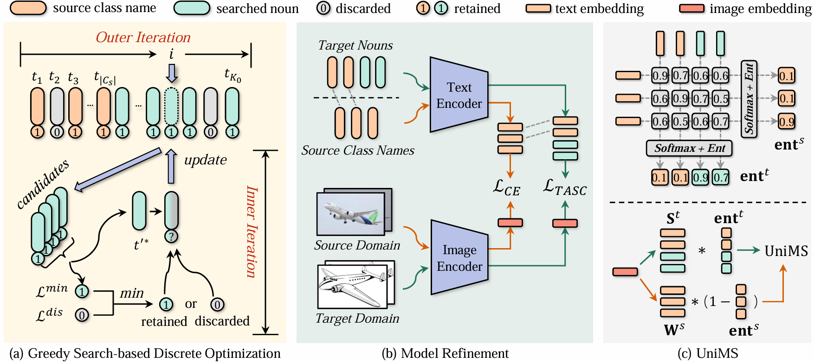

<h2 align="center">
<a href="https://arxiv.org/abs/2504.10020">[AAAI 2025] Target Semantics Clustering via Text Representations for Robust Universal Domain Adaptation
</a></h2>

<h5 align="center"> If you find our project useful, we’d appreciate your support with a star ⭐ on GitHub to receive the latest updates.</h5>

<h5 align=center>
  
[](https://arxiv.org/abs/2506.03521)
[](https://paperswithcode.com/sota/universal-domain-adaptation-on-office-home?p=target-semantics-clustering-via-text)

[](https://paperswithcode.com/sota/universal-domain-adaptation-on-domainnet?p=target-semantics-clustering-via-text)
[](https://paperswithcode.com/sota/universal-domain-adaptation-on-visda2017?p=target-semantics-clustering-via-text)

</h5>


> Weinan He, Zilei Wang, Yixin Zhang
>
> *Thirty-ninth AAAI Conference on Artificial Intelligence (AAAI 2025)*

> Universal Domain Adaptation (UniDA) focuses on transferring source domain knowledge to the target domain under both domain shift and unknown category shift. Its main challenge lies in identifying common class samples and aligning them. Current methods typically obtain target domain semantics centers from an unconstrained continuous image representation space. Due to domain shift and the unknown number of clusters, these centers often result in complex and less robust alignment algorithm. In this paper, based on visionlanguage models, we search for semantic centers in a semantically meaningful and discrete text representation space. The constrained space ensures almost no domain bias and appropriate semantic granularity for these centers, enabling a simple and robust adaptation algorithm. Specifically, we propose TArget Semantics Clustering (TASC) via Text Representations, which leverages information maximization as a unified objective and involves two stages. First, with the frozen encoders, a greedy search-based framework is used to search for an optimal set of text embeddings to represent target semantics. Second, with the search results fixed, encoders are refined based on gradient descent, simultaneously achieving robust domain alignment and private class clustering. Additionally, we propose Universal Maximum Similarity (UniMS), a scoring function tailored for detecting open-set samples in UniDA. Experimentally, we evaluate the universality of UniDA algorithms under four category shift scenarios. Extensive experiments on four benchmarks demonstrate the effectiveness and robustness of our method, which has achieved state-of-the-art performance.


## 🌈 Method

<p align="center">
  
</p>

## 📋 Project Structure

The project structure is presented as follows:

```
├── configs
│   └── unida.yaml                         # configs
├── data
│   ├── models
│   ├── WordNet
│   ├── nltk_data
│   ├── office
│   ├── officehome
│   ├── ...
│   └── txt
├── sapphire                               # engine
├── train_sapphire_CLIPLoRABase.py 
├── train_sapphire_TASCBase.py    
├── train_sapphire_TASC.py                 # TASC
└── train_sapphire.py
```

### Core files

  1. Datasets: `./sapphire/datasets/universalDA.py` `UniversalDataset`
  2. TASC algorithm: `./train_sapphire_TASC.py`

## 🕹️ Steps to reproduce the results

### Prerequisites:

 - python == 3.10.8
 - pytorch ==1.13.1
 - CUDA 11.6
 - Due to some unknown issues with `faiss.kmeans`, please reproduce on RTX3090 or RTX3080ti. (**IMPORTANT**)

```shell
conda create -n tasc python==3.10.8 -y
conda activate tasc
conda install pytorch==1.13.1 torchvision==0.14.1 torchaudio==0.13.1 pytorch-cuda=11.6 -c pytorch -c nvidia -y
conda install lightning -c conda-forge -y
pip install git+https://github.com/openai/CLIP.git
pip install -r requirements.txt
pip install -U openmim
mim install mmcv-full==1.7.2
pip install mmcls==0.25.0
```

### Preparing your data and model checkpoints:

 1. Download txt files from this [link](https://github.com/Sapphire-356/TASC/releases/download/v0.1/txt.tar). Link the dataset to `./data/`. For example, the structure of Office dataset should be:

    ```
    ├── data
    │   ├── office
    │   │   ├── amazon
    │   │   ├── dslr
    │   │   └── webcam 
    │   └── txt
    ```

 2. Download the checkpoints of VLMs from this [link](https://github.com/Sapphire-356/TASC/releases/download/v0.1/ViT-B-16.pt), and follow this structure:

    ```
    ├── data
    │   └── models
    │       └── clip
    │           └── ViT-B-16.pt
    ```

 3. (Recommended) Download the `.pth` file containing the text embeddings of nouns in WordNet extracted by us: [nouns_features](https://github.com/Sapphire-356/TASC/releases/download/v0.1/nouns_feat_rm_redundancy_ensemble.pth). Put it into `./data/WordNet/`.

 4. Download WordNet data from this [link](https://github.com/Sapphire-356/TASC/releases/download/v0.1/nltk_data.tar) or follow the code below, and put the nltk_data to `./data/`.

    ```python
    import nltk
    nltk.download('wordnet')
    ```


### Training

**Custom settings**

 1. Modify the configuration file `./configs/unida.yaml` to the task you want to reproduce.

 2. Run python by:

    ```shell
    python train_sapphire.py --cfg configs/unida.yaml
    ```

  3. Check the output files in `./output/`. More results can be visualized through TensorBoard.

**Reproducing our results**

1. You can using the following script for reproducing our results:

   ```shell
   # Office
   bash start_exp.sh train_sapphire.py configs-reproduce/exp-re office OPDA 0
   bash start_exp.sh train_sapphire.py configs-reproduce/exp-re office ODA 0
   bash start_exp.sh train_sapphire.py configs-reproduce/exp-re office PDA 0
   bash start_exp.sh train_sapphire.py configs-reproduce/exp-re office CDA 0

   # Office-Home
   bash start_exp.sh train_sapphire.py configs-reproduce/exp-re officehome OPDA 0
   bash start_exp.sh train_sapphire.py configs-reproduce/exp-re officehome ODA 0
   bash start_exp.sh train_sapphire.py configs-reproduce/exp-re officehome PDA 0
   bash start_exp.sh train_sapphire.py configs-reproduce/exp-re officehome CDA 0

   # VisDA
   bash start_exp.sh train_sapphire.py configs-reproduce/exp-re visda OPDA 0

   # DomainNet
   bash start_exp.sh train_sapphire.py configs-reproduce/exp-re domainnet OPDA 0
   ```

2. Modify the configuration in `exp_scripts/get_results.py` and then process results using the following command:
   ```shell
   python exp_scripts/get_results.py
   ```

## ✏️ Citing this work

If you find this repo useful for your research, please consider citing our paper:

```
@inproceedings{he2025target,
  title={Target Semantics Clustering via Text Representations for Robust Universal Domain Adaptation},
  author={He, Weinan and Wang, Zilei and Zhang, Yixin},
  booktitle={Proceedings of the AAAI Conference on Artificial Intelligence},
  volume={39},
  number={16},
  pages={17132--17140},
  year={2025}
}
```

## 📧 Contact

If you have further questions or discussions, feel free to contact me:

Weinan He (hwn2018@mail.ustc.edu.cn)
